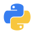
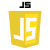

<!DOCTYPE html>
<html lang="en">
<head>
    <meta charset="UTF-8">
    <meta name="viewport" content="width=device-width, initial-scale=1.0">
    <link rel="stylesheet" href="static/files/style.css">
    <link href="https://cdn.jsdelivr.net/npm/bootstrap@5.0.0-beta1/dist/css/bootstrap.min.css" rel="stylesheet" integrity="sha384-giJF6kkoqNQ00vy+HMDP7azOuL0xtbfIcaT9wjKHr8RbDVddVHyTfAAsrekwKmP1" crossorigin="anonymous">
    <title>#</title>
</head>
<body>
    
    <h2>Sobre:</h2>

    

    
    
Nome: Kevin Lyon

    
Nacido em: 14/02/2000

    
Naturalidade: Rio grande do sul/BR

    
Estudante da <a href="https://solyd.com.br"><button type="button" class="btn btn-primary btn-sm">Solyd Treinamentos</button></a>

    <a href="https://www.youtube.com/channel/UC9tSm6hsH2c5atpEObIaD8Q"><button type="button" class="btn btn-outline-danger">Youtube</button></a>

    <a href="https://www.linkedin.com/in/kevin-lyon-61850b1b2/"><button type="button" class="btn btn-outline-primary">Linkedin</button></a>

     
    <h2>Linguagens:</h2>
    

     
    <a href="https://www.python.org/"><button type="button" class="btn btn-outline-dark">Python</button></a>
    <a href="https://www.djangoproject.com/"><button type="button" class="btn btn-outline-info">Django</button></a>
    <a href="https://developer.mozilla.org/pt-BR/docs/Web/JavaScript"><button type="button" class="btn btn-outline-warning">JavaScript</button></a>

    <dir class="img">
        
        
        
        
            
    </dir>

    
</body>
</html>